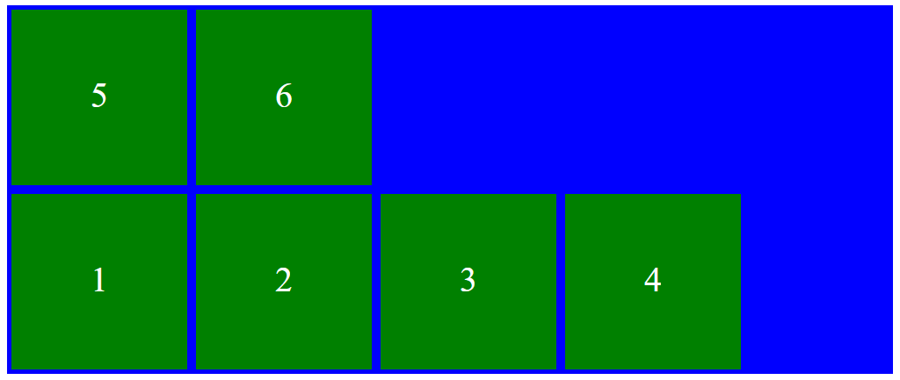
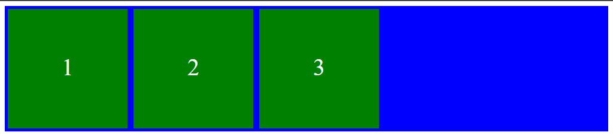
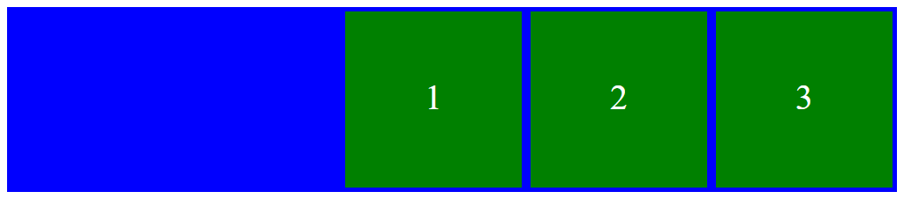

# Unix Command Line
Saat kita menyebut "command line" atau "command line interface", sebenarnya yang dimaksud adalah shell yang berbasis teks. Shell ini adalah program yang menerima perintah, kemudian meneruskan perintah tersebut ke system untuk dieksekusi.  Selain command line, kita juga punya shell berbasis grafis yang lebih dikenal dengan nama GUI atau graphical user interface.

GUI ini ada banyak macamnya, misalnya :
- Windows
- macOS
- Ubuntu

Shell berbasis teks atau CLI juga ada banyak macamnya, misalnya :
- sh
- bash
- zsh
- cmd.exe 

Untuk mengakses CLI, kita menggunakan sebuah program yang bernama terminal emulator.

## Filesystem
Sebuah filesystem mengatur bagaimana data disimpan di dalam sebuah system. Sistem operasi Windows & Unix-like menyusun file dan direktori menggunakan struktur yang bentuknya mirip tree.

GUI yang kita lihat sebenarnya memiliki struktur seperti pohon. Sebuah direktori bisa memiliki file dan sub-direktori, kemudian sub-direktori bisa memiliki file dan sub-direktori, dan seterusnya. Dalam sebuah filesystem direktori tree, terdapat direktori yang paling atas atau yang paling pertama disebut 'root directory'.

Yang membedakan antara windows dengan sistem operasi milik unix, biasanya sistem operasi unix hanya memiliki satu tree atau satu direktori. Sedangkan windows memiliki beberapa root directory, dimana masing-masing partisi penyimpanan seperti local disk C, D, dan E memiliki direktorinya sendiri.

## Command untuk Navigasi
- pwd (Print Working Directory): Command untuk melihat current working directory.
- ls (lists): Command untuk melihat isi file yang ada di sebuah direktori.
- cd (Change Directory): Command untuk berpindah direktori.

## Absolute & Relative Pathname
-   Absolute pathname dimulai dari root directory.
    ```
    Users/user/Work/GitHub/skilvul/tugas
    ```
-   Relative pathname dimulai dari current working directory.
    ```
    ./catatan
    (dari current working directory, kemudian ke ‘catatan’)
    ```
## Manipulasi Files & Directory
- touch: Command untuk membuat sebuah file.
- mkdir: Command untuk membuat sebuah direktori.
- head: Command untuk melihat beberapa line awal dari sebuah file text.
- tail: Command untuk melihat beberapa line akhir dari sebuah file text.
- cat: Command untuk melihat isi sebuah file.
- cp: Command untuk mengcopy files atau directory.
- mv: Command untuk memindahkan files atau directory. Bisa juga digunakan untuk rename.
- rm: Command untuk menghapus file atau directory.

# Git & GitHub
Version control system adalah sebuah sistem yang merekam semua perubahan yang ada di projek dari waktu ke waktu. Version control system yang paling sering digunakan ialah git. Git dibuat oleh Linus Torvalds pada tahun 2005. Git biasanya digunakan oleh para programmer sebagai tempat penyimpanan file pemrograman mereka, karena lebih efektif. Dengan menggunakan git semua developer memiliki rekam perubahan yang lengkap dari sebuah projek. Dalam git projek ini disebut git repository.
Semua developer memiliki rekam perubahan yang sama dengan menggunakan remote repository.
Contoh layanan git remote repository:
- GitHub
- GitLab
- Bitbucket

## Tahap Bekerja dengan Git
- Working directory: Membuat file, memodifikasi file, menghapus file
- Staging: Files yang siap disimpan atau dicommit.
- Commit: Perubahan files disimpan sebagai commit.

## 3 Kondisi File pada Git
- Modified: kondisi dimana revisi atau perubahan sudah dilakukan, tetapi belum ditandai (untracked) dan belum disimpan dalam version control.
- Staged: kondisi dimana revisi sudah ditandai (modified) namun belum disimpan di version control.
- Committed: kondisi dimana revisi sudah disimpan pada version control.

## Konfigurasi Git
- ### Cek Instalasi
    ```
    git --version
    ```
- ### Setup Awal
    ```
    git config --global user.name "Rizky Merdika Agusta"
    git config --global user.email contoh@domain.com
    ```
- ### Membuat Git Repository
    ```
    git init
    ```
- ### Mengecek Perubahan yang Terjadi
    ```
    git status
    ```
- ### Menambahkan Perubahan ke Staging Area
    ```
    git add <nama_file>
    ```
- ### Menyimpan Perubahan di Staging Area
    ```
    git commit -m "message"
    ```
- ### Melihat Histori Perubahan pada Project
    ```
    git log
    ```
    ```
    git log --oneline
    ```
- ### Menampilkan Isi dari File yang Berubah
    ```
    git diff
    ``` 
- ### HEAD adalah pointer yang menunjuk ke commit yang sedang aktif. Untuk melihat commit yang sedang ditunjuk oleh HEAD bisa menggunakan:
    ```
    git show HEAD
    ```
- ### Membatalkan Perubahan - Belum Stagged dan Belum Commited
    ```
    git checkout <nama_file>
    ```
- ### Mengganti Branch atau Commit yang Sedang Aktif
    ```
    git checkout <nama branch | commit hash>
    ```
- ### Membatalkan Semua Perubahan yang Ada
    ```
    git reset <nama_file>
    ```
- ### Membatalkan Semua Perubahan yang Ada tanpa Menghapus Commit Terakhir
    ```
    git revert -n <commit hash>
    ```
- ### Membuat Branch
    ```
    git branch <nama-branch>
    ```
- ### Melihat List Branch
    ```
    git branch
    ```
- ### Menghapus Branch
    ```
    git branch -d <nama_branch>
    ```
- ### Menyatukan Branch Cabang ke Branch Master. Harus checkout dahulu ke branch master.
    ```
    git merge <nama_branch>
    ```
- ### Menghubungkan Local Repository ke Remote Repository
    ```
    git remote add <nama_repository> <url-repository>
    ```
- ### Melihat Daftar Repository
    ```
    git remote
    ```
- ### Mengirim Perubahan dari Local Repository ke Remote Repository
    ```
    git push --set-upstream origin master
    ```
- ### Mengambil Perubahan pada Remote Repository tanpa Menggabungkan Perubahan Tersebut ke Local Repository
    ```
    git fetch
    ```
- ### Mengambil Perubahan pada Remote Repository dan Menggabungkan Perubahan Tersebut ke Local Repository
    ```
    git pull
    ```
- ### Mendownload sebuah Project dari GitHub ke Komputer
    ```
    git clone <url-repository> <nama_folder>
    ```
- ### Untuk menggabungkan dua buah branch di remote repository, kita perlu melakukan Pull Request.
- ### GitHub Fork digunakan untuk menyalin sebuah repository ke akun GitHub kita.

# HTML
HTML adalah singkatan dari Hypertext Markup Language. HTML digunakan untuk menampilkan konten pada browser. Konten yang dapat ditampilkan seperti text, image, video, audio, dan masih banyak lagi. HTML bukan bahasa pemrograman karena tidak bisa mengolah data, hanya menampilkan konten saja. Fungsi HTML adalah sebagai 'kerangka', yang memberi struktur pada website.

Ada 2 tools utama yang harus dipersiapkan untuk membuat HTML:
1. Browser
2. Code Editor

Salah satu code editor yang populer banyak digunakan programmer adalah visual studio code. Visual studio code bisa diunduh pada link berikut.
```
https://code.visualstudio.com/
```

Rekomendasi exntensions untuk diinstall pada vscode:
1. Live Server
2. Auto Rename Tag
3. Auto Close Tag
4. Prettier

## Struktur Dasar HTML
Struktur dasar HTML terdiri dari tiga tag utama yaitu html, head, dan body.
```html
<!DOCTYPE html>
<html lang="en">
<head>
    <meta charset="UTF-8">
    <meta http-equiv="X-UA-Compatible" content="IE=edge">
    <meta name="viewport" content="width=device-width, initial-scale=1.0">
    <title>Document</title>
</head>
<body>

</body>
</html>
```
- Tag html adalah root element dari HTML.
- Tag head umumnya berisi meta, title, link, script.
- Tag body merupakan konten dari HTML.

## HTML Tag
HTML terdiri dari komponen yang disebut HTML Tag.
Pada umumnya, ada 2 tipe HTML Tag:
- Opening Tag (tag pembuka).
- Closing Tag (tag penutup).
```html
<p>Hello World !</p>
 |                |
 v                V
tag              tag
pembuka          penutup
```

## HTML Element
HTML Element merupakan sebuah komponen dalam halaman web. HTML element dimulai dari Opening Tag hingga Closing Tag. 
Biasanya HTML element terdiri dari:
- Opening tag
- Closing tag
- Atribute
- Content

Struktur dari sebuah HTML element dapat digambarkan seperti ini:
```html
<p style= "color = red">My first paragraph</p>
```
Ada dua jenis HTML Element, yaitu:
1. HTML Element yang memiliki Opening Tag (tag pembuka) dan Closing Tag (tag penutup). Contoh:
    ```html
    <h1></h1>
    ```
2. Empty HTML Element yang memiliki Self-closing Tag, yang hanya memiliki Opening Tag (tag pembuka) dengan garis miring sebelum kurung tutup. Contoh:
    ```html
    
    ```

## HTML Attribute
Di dalam Opening Tag dapat berisi attribute, fungsinya untuk memberikan informasi tambahan kepada element. Contoh penggunaan atribute:
```html

```
- width adalah attribute untuk mengatur lebar dari element.
- src adalah attribute untuk menentukan sumber sebagai value dari element.

## HTML Comment
Kita dapat memberikan penjelasan dari code yang kita kerjakan dengan menggunakan comment. Comment tidak akan dieksekusi oleh sistem. Comment hanya untuk dibaca oleh sesama programmer.<br>
Contoh penggunaan comment:
```html
<body>
    <!-- Ini adalah header dari halaman -->
    <h1>Ini Header</h1>
</body>
```

## Menjalankan HTML
1. Secara Manual <br>
Kita bisa menjalankan HTML dengan mencari lokasi file HTML di file explorer lalu membukanya via browser.
    
2. Menggunakan Live Server <br>
Kekurangan menggunakan cara manual kita perlu refresh halaman jika ada perubahan content. Solusinya adalah menggunakan extensions live server pada vscode. Jika sudah diinstall kita menggunakannya dengan klik kanan pada file HTML kemudian pilih live server. Atau bisa menekan Go Live pada menu di pojok kanan bawah.
    

    

## HTML Tag Populer
- img, untuk menampilkan gambar.
```html

```
- video, untuk menampilkan video.
```html
<video>
    <source src="video.mp4"/>
</video>
```
- table, untuk membuat tabel.
```html
<table>
    <tr>
        <th>Nama</th>
    </tr>
    <tr>
        <td>Rizky</td>
    </tr>
</table>
```
- form, untuk mengambil input dari user, konsepnya seperti formulir.
```html
<form>
    <label for = "username">Username</label>
    <input type = "text" placeholder = "Your Username">
</form>
```

## Semantic HTML
Semantic element adalah element html yang maknanya sesuai dengan kebutuhan konten. Semantic element menjelaskan tujuan dari element tersebut kepada browser serta programmer lain sehingga memudahkan programmer juga untuk membaca kode.<br>
Berikut adalah beberapa contoh dari semantic element:
```html
<nav> bagian berisi navigasi utama.
<header> bagian tajuk dari halaman web.
<section> bagian dalam sebuah halaman web.
<aside> bagian samping dari konten utama.
<footer> bagian bawah dari halaman web.
```
Kegunaan lain dari semantic HTML:
- Meningkatkan Accessibility 
- Meningkatkan SEO 
- Lebih mudah di maintain

## Code Snippet
Code snippet adalah komponen yang bisa mempercepat programming. Dengan code snippet kita bisa menulis banyak kode dan potongan tag tanpa harus ditulis satu per satu. Contoh:
```html
// Code snippet
ol>li*3
// Hasilnya seperti ini
<ol>
    <li></li>
    <li></li>
    <li></li>
</ol>
```

## Deploy HTML
Deploy adalah proses mempublikasi aplikasi yang kita kerjakan. Lalu bagaimana mendeploy HTML kita? <br>
Solusinya dengan menggunakan tools bernama netlify.


Langkah-langkah mendeploy HTML ke Netlify :

1. Masuk ke netlify.com kemudian lakukan registrasi menggunakan email atau akun GitHub. Direkomendasikan menggunakan akun GitHub.
2. Setelah login masuk ke tab Sites lalu drag and drop seluruh folder html kalian.
3. Kalian juga bisa import projek HTML kalian melalui Git repository.
4. Projek HTML sudah ter-deploy. Kalian juga akan mendapatkan domain url dari projek kalian sehingga bisa diakses melalui internet.

# CSS
CSS singkatan dari cascading style sheets. Jika menggunakan HTML, kita belum dapat mendesain halaman website. Solusinya adalah menggunakan CSS. CSS adalah bahasa yang digunakan untuk mendesain halaman website. Dengan CSS, kita bisa mengubah warna, menggunakan font custom, editing text format, mengatur tata letak, dan lainnya.

## Cara Menyisipkan CSS
Terdapat 3 cara menyisipkan CSS ke dalam HTML.

- Inline, menambahkan CSS pada attribute element HTML.
    ```html
    <p style = "color: red; font-size: 24 px;">This Paragraph Using Inline Styles</p>
    ```
- Internal, menggunakan tag style yang disisipkan di tag head pada file HTML.
    ```html
    <html lang="en">
    <head>
        <style>
            p{
                color: blue;
                font-size: 24px;
            }
        </style>
    </head>
    <body>
        <p>This Paragraph Using Internal Styles</p>
    </body>
    </html>
    ```
- External, membuat code CSS di file tersendiri dan terpisah dari file HTML. Kita harus membuat link di dalam file HTML untuk terhubung dengan file CSS.
    ```html
    <html lang="en">
    <head>
        <link rel="stylesheet" type="text/css" href="style.css">
    <style>
    </head>
    <body>
        <p>This Paragraph Using Internal Styles</p>
    </body>
    </html>

    /*Isi File CSS*/
    p{
    color: blue;
    font-size: 24px;
    }
    ```
    Tidak ada aturan baku untuk penempatan path file .css. Direkomendasikan dalam satu folder yang sama.

## Struktur CSS
Sintaks CSS terdiri dari elemen HTML, properti, dan value.
```css
/*Sintaks CSS*/
.elementHTML{
    property : value;
}

/*Contoh*/
h1{
    color: blue;
    font-size: 24px;
}
```

## Menerapkan Styling CSS
- **CSS - Tag Name** <br>
Kita bisa menggunakan Tag Elemen HTML secara langsung pada CSS. Jika menggunakan Tag Element, maka ini bersifat global.
    ```css
    div{
        background-color : black;
    }
    ```
- **CSS - Class Name** <br>
Kita bisa menggunakan attribute class pada elemen HTML lalu memanggil nama class tersebut pada CSS. Gunakan (.) saat memanggil class pada CSS.
    ```css
    .title{
        color : brown;
    }
    ```
- **CSS - Multiple Class** <br>
Kita dapat menggunakan lebih dari 1 class yang berbeda untuk 1 element HTML.
    ```html
    //Isi file HTML
    <h1 class = "title uppercase">This is My Blog</h1>
    <h1 class = "title lowercase">This is My Content</h1>
    ```
    ```css
    //Isi file CSS
    .title{
        color : brown;
    }
    .uppercase{
        text-transform : uppercase;
    }
    .lowercase{
        text-transform : lowercase;
    }
    ```
- **CSS - ID Name** <br>
Kita bisa menggunakan attribute id pada elemen HTML lalu memanggil nama id tersebut pada CSS. Gunakan (#) saat memanggil class pada CSS.
    ```css
    #navigasi{
        margin : 0;
        padding : 0;
    }
    ```
- **Chaining Selectors** <br>
Chaining selector dapat kita gunakan contoh kasus ketika memiliki 3 tag elemen HTML pada CSS namun kita ingin ada 1 elemen HTML yang memiliki styling berbeda. 
    ```html
    //Isi file HTML
    <h1>This is My Blog</h1>
    <h1 class = "title">This is My Content</h1>
    ```
    ```css
    h1{
        color : brown;
    }
    h1.title{
        color : green;
    }
    ```
- **Nested Element** <br>
Konsep CSS sama dengan HTML yaitu setiap element memiliki parent dan child. Child akan mengikuti styling rules dari parent.
    ```html
    //Isi file HTML
    <div class = "parent">
        <h1>This is My Content</h1>
    </div>
    ```
    ```css
    /*Child pada class parent akan mengikuti styling rules dari parent*/
    .parent{
        text-align : center;
    }
    ```
- **!important CSS** <br>
!important CSS berada di level paling atas dari ID dan Class. Jika pada styling CSS kita menggunakan !important, maka styling sebelumnya baik itu ID Name atau Class Name akan di override.
    ```css
    h1{
        color : brown !important;
    }

    /*style title akan dioverride dengan style tag h1 karena menggunakan !important*/
    h1.title{
        color : green;
    }
    ```
- **Multiple Selector** <br>
Pada CSS kita bisa membuat code lebih efisien dan tidak repetitive.
    ```css
    /*Sebelum menggunakan Multiple Selector*/
    h1{
        color : brown;
        font-family : 'Roboto', sans-serif;
    }
    p{
        font-family : 'Roboto', sans-serif;
    }

    /*Setelah menggunakan Multiple Selector*/
    h1{
        color : brown;
    }
    h1, p{
        font-family : 'Roboto', sans-serif;
    }
    ```

## Flexbox
Flexbox adalah cara untuk mengatur layout. Flexbox memiliki kemampuan untuk menyesuaikan layout secara otomatis. Penggunaannya yang mudah dan didukung berbagai browser membuat flexbox ini direkomendasikan untuk digunakan. Konsepnya sederhana. Flexbox memiliki 1 parent dan bisa beberapa child.

Untuk menggunakan flexbox kita cukup menambahkan property display: flex; pada element HTML.
```css
div{
    display : flex;
}
```

### Ordering & Orientation
1. flex-direction <br>
Properti flex-direction digunakan untuk mengatur arah letak item child.  Terdapat 4 value flex-direction:
    - row (default): secara default letak item child membentuk sebuah baris dari kiri ke kanan.
    
    - row-reverse: letak item child membentuk sebuah baris dari kiri ke kanan.
    
    - column: letak item child membentuk sebuah baris dari atas ke bawah.
    
    - column-reverse: letak item child membentuk sebuah baris dari bawah ke atas.
    

2. flex-wrap <br>
Flex secara default akan membuat tata letak item children dalam 1 line saja. Namun jika kamu ingin membatasi jumlah item children dalam 1 line lalu item children yang lain akan pindah ke posisi line yang baru, maka kita bisa menggunakan flex-wrap. Properti flex-wrap memiliki 3 value:
    - no-wrap (default): secara default , flex tidak menggunakan flex-wrap.
    
    - wrap: flex item akan memiliki beberapa line dari atas ke bawah  jika space dalam 1 line sudah full width.
    
    - wrap-reverse: kebalikan dari wrap yaitu lex item akan memiliki beberapa line dari bawah ke atas  jika space dalam 1 line sudah full width.
    

3. flex-flow <br>
Properti flex-flow digunakan sebagai shortcut untuk set up flex-direction dan flex-wrap bersamaan.

4. order <br>
Properti order pada flex adalah berfungsi untuk ordering item mana yang ingin kita atur posisinya berdasarkan urutan order. Terdapat 3 value dari properti order:
    - -1 : Item child yang di set order -1, maka item child tersebut akan berada di ordering paling awal atau paling kiri.
    
    - 0 (default) : Flex secara default memiliki order 0 pada setiap item child. Ini berarti 0 akan membuat item child sesuai urutan pada html.
    - 1: Item child yang di set order 1, maka item child tersebut akan berada di ordering paling akhir atau paling kanan.
    

### Alignment
1. justify-content <br>
Properti justify-content digunakan untuk mengatur tata letak dan space antar item child secara horizontal atau main axis. justify-content memiliki 6 value yaitu:
    - flex-start (default)
    
    - flex-end
    
    - center
    
    - space-between
    
    - space-around
    
    - space-evenly
    

2. align-items <br>
Properti align-items digunakan untuk mengatur align dari item child secara vertikal atau cross axis. align-items memiliki 5 value:
    - flex-start
    
    - flex-end
    
    - center
    
    - baseline
    
    - stretch (default)
    

# Algoritma
Algoritma adalah proses yang dilakukan dengan cara ynag logis (masuk akal) dan sistematis untuk menyelesaikan suatu masalah. Algortima ini sangat penting dalam programming karena programming itu identik dengan memecahkan suatu permasalahan, jadi dengan algoritma kita bisa menganalisa alur berpikir yang terstruktur. Bahasa pemrograman apapun yang dipakai oleh programmer, dengan algoritma ini para programmer jadi memiliki alur berpikir yang sama. 

## Ciri-ciri Algoritma
1. Harus memiliki input. Contoh : satu bungkus indomie.
2. Memiliki minimal satu buah output. Contoh : semangkok mie.
3. Instruksi jelas, tidak ambigu (Definiteness). Contoh : mulai dari menyiapkan indomie sampai tahap pembuatannya.
4. Memiliki titik berhenti (Finiteness). Contoh : mie siap disajikan.
5. Sebisa mungkin tepat sasaran dan efisien (Effectiveness).

## Jenis Proses Algoritma
1. Sequence: instruksi dijalankan secara berurutan.
2. Selection: instruksi yang dijalankan jika memenuhi syarat tertentu.
3. Iteration: instruksi yang dijalankan berulang-ulang jika memenuhi kondisi tertentu.
4. Concurrent: beberapa instruksi dijalankan secara bersamaan.

## Penyajian Algoritma
1. Deskriptif <br>
Penulisan algoritma dengan cara deskriptif seperti kita menulis tutorial (tata cara) dengan bahasa sehari-hari. <br>
Contoh:
    ```
    Mengambil air minum:
    1. Pergi ke dapur.
    2. Ambil gelas di rak.
    3. Pergi ke dispenser.
    4. Isi Gelas dengan air.
    5. Jika air sudah penuh.
    6. Air siap diminum.
    ```
2. Flow Chart <br>
Flow chart atau diagram alir, penyajian algoritmanya lebih mudah dibaca karena memiliki tampilan visual. Flow chart menggunakan simbol bangun datar sebagai representasi dari proses yg dilakukan.<br>
Contoh:


3. Pseudo Code<br>
Penulisan algoritma yg hampir menyerupai penulisan pada kode pemrograman. Pada umumnya pseudocode memiliki 3 bagian:
    1. Judul : Penjelasan dari algoritma yg dibuat.
    2. Deklarasi : Mendefinisikan/menyiapkan semua nama (variabel) yg akan digunakan.
    3. Deskripsi : langkah-langkah penyelesaian masalah.

    Contoh:
    ```
    Judul
        Menentukan Angka Ganjil atau Genap
    Deklarasi
        angka = bilangan bulat
    Deskripsi
        if angka%2 = 1
            cetak "Ganjil"
        else
            cetak "Genap"
        end
    ```

# JavaScript
Javascript adalah bahasa pemograman yang sangat powerful yang digunakan untuk logic pada sebuah website. Javascript dapat membuat website menjadi interaktif dan dinamis.

## Menjalankan JavaScript
Javascript dijalankan melalui browser. Umumnya browser Chrome dan Mozilla yang sudah support untuk semua fitur Javascript. 

- Syntax dan Statement<br>
Syntax bisa dianalogikan sebagai tata cara pada bahasa pemrograman. Syntax digunakan untuk membuat statement program, instruksi untuk dijalankan oleh web browser. Contoh Syntax Javascript :<br>
    1. alert()
    
    2. Prompt()
    
    3. Confirm()
    
- Console Log<br>
Console log adalah tempat untuk mengecek logic pemograman web yang kita kembangkan. Console log juga tempat kita untuk melakukan debugging pada pemrograman web.
    ```javascript
    console.log()
    ```

## Tipe Data
Tipe data adalah klasifikasi yang kita berikan untuk berbagai macam data yang digunakan dalam programming.
Ada 6 tipe data fundamental pada Javascript:
- number<br>
Tipe data yang mengandung semua angka termasuk angka desimal.
    ```javascript
    let angka = 1
    let angka = 1.5
    ```
- string<br>
Tipe data yang mengandung grup karakter bisa terdiri dari huruf, angka, spasi, simbol, dan lainnya. Harus diawali dan diakhiri dengan single quotes ‘ … ‘ ataupun double quotes “ … “.
    ```javascript
    let string1 = "Lesson 1: Introduction"
    ```
- boolean<br>
Tipe data yang hanya mempunyai 2 buah nilai yaitu TRUE atau FALSE.
    ```javascript
    let a = true
    let b = false
- null<br>
Tipe data yang diartikan bahwa sebuah variable atau data tidak memiliki nilai.
    ```javascript
    let c = null
    ```
- undefined<br>
Tipe data yang merepresentasikan varibel/data yang tidak memiliki nilai. Undefined didapat dari hasil berikut:<br>
    1. Nilai dari pemanggilan variabel yang belum didefinisikan.
    2. Nilai dari pemanggilan element array yang tidak ada.
    3. Nilai dari pemanggilan property objek yang tidak ada.
    4. Nilai dari pemanggilan fungsi yang tidak mengembalikan nilai (return).
    5. Nilai dari parameter fungsi yang tidak memiliki argumen.
    ```javascript
    let a = "nasi"
    let b = "telur"
    let c

    console.log(c) // undefined
    ```
- object<br>
Koleksi data yang saling berhubungan (related). Tipe data object dapat menyimpan data dengan tipe data apapun.
    ```javascript
    let karyawan = {
        nama: "Rizky",
        umur: 21,
        posisi: "Admin"
    }
    ```
## Variabel
Variabel adalah tempat untuk menyimpan sebuah nilai. Ada 3 cara mendefinisikan sebuah variabel.
- var
    ```javascript
    var myName = "Rizky"
    console.log(myName) // Output: Rizky
    var myName = "Nur" // kekurangan var bisa deklarasi lagi variabel yang namanya sama
    ```
- let
    ```javascript
    let myName = "Rizky"
    console.log(myName) // Output: Rizky
    myName = "Nur"
    console.log(myName) // Output: Nur

    // Dengan let variabel dapat diubah nilainya
    ```
- const
    ```javascript
    const myName = "Rizky"
    console.log(myName) // Output: Rizky
    myName = "Nur"
    console.log(myName) // Error

    // Dengan const variabel tidak dapat diubah nilainya
    ```

## Operator
- Assignment Operator (=)<br>
Assignment operator digunakan untuk menyimpan sebuah nilai pada variabel.
    ```javascript
    let myName = "Rizky";

    let a = 3;
    a += 1;
    console.log(a); // Output: 4
    ```
- Arithmetic Operator<br>
Arithmetic operator adalah operator yang melibatkan operasi matematika.
    1. Tambah (+)
    2. Kuramg (-)
    3. Perkalian (*)
    4. Pembagian (/)
    5. Modulus (%)
    6. Increment (++)
    7. Decrement (--)
    ```javascript
    console.log(9%2) //Output: 2
    ```
- Comparison Operator<br>
Comparison operator adalah operator yang membandingkan satu nilai dengan nilai lainnya. Hasil operasi yang melibatkan comparison operator adalah antara true or false.
    1. Lebih kecil dari : <
    2. Lebih besar dari: >
    3. Lebih kecil atau sama dengan: <=
    4. Lebih besar atau sama dengan: >=
    5. Sama dengan (value sama): ==
    6. Sama dengan (value dan tipe data sama): ===
    7. Tidak sama dengan: !==
    ```javascript
    7 < 10 // menghasilkan true
    3 > 5 // menghasilkan false
    ```
- Logical Operator<br>
Logical operator biasa digunakan untuk sebuah CONDITIONAL pada pemograman. Menghasilkan nilai BOOLEAN yaitu TRUE or FALSE. Simbol dari Logical Operator adalah sebagai berikut:
    1. AND operator : &&
    2. OR operator: ||
    3. NOT operator: !
    ```javascript
    console.log(true&&true)// true
    console.log(true||false)// true
    console.log(!true)// false
    ```

## Conditional
Conditional merupakan statement percabangan yang menggambarkan suatu kondisi. Conditional statement akan mengecek kondisi spesifik dan menjalankan perintah berdasarkan kondisi tersebut. Yang dicek adalah apakah kondisi tersebut TRUE (benar). Jika TRUE maka code didalam kondisi tersebut dijalankan.
- IF Statement
    ```javascript
    let lapar = true
    if(lapar){
        console.log("Yuk berangkat")
    }
    ```
- IF...Else Statement
    ```javascript
    let lapar = true
    if(lapar){
        console.log("Yuk berangkat")
    }
    else{
        console.log("Tidak jadi berangkat")
    }
    ```
- IF..Else IF Statement
    ```javascript
    let color = "red"
    if(color === "green"){
        console.log("Maju")
    }else if(color === "yellow"){
        console.log("Siap-siap")
    }else if(color === "red"){
        console.log("Berhenti")
    }else{
        console.log("Unknown")
    }
    ```
- Truthy and Falsy<br>
Truthy and falsy digunakan untuk mengecek apakah variabel telah terisi namun tidak mementingkan nilainya.
    ```javascript
    let myName
    if(myName){
        console.log(myName)
    }else{
        myName = "Rizky"
        console.log("myName")
    }
    ```
- Switch Case Conditional
    ```javascript
    let hari = "Senin"
    switch(hari){
        case "Senin":{
            console.log("Putih-putih");
            break;
        }
        case "Selasa":{
            console.log("Putih-merah");
            break;
        }
        case "Rabu":{
            console.log("Kotak-kotak");
            break;
        }
        case "Kamis":{
            console.log("Batik");
            break;
        }
        case "Jum'at":{
            console.log("Baju Muslim");
            break;
        }
        default:{
            console.log("Unknown");
        }
    }
    ```
- Ternary Operator
    ```javascript
    let isSale = true
    isSale ? console.log("Beli") : console.log("Tidak jadi beli")
    // Output: Beli
    ```

## Looping
Looping adalah statement yang mengulang sebuah instruksi hingga kondisi terpenuhi atau jika kondisi stop atau berhenti tercapai.
- For Loop<br>
FOR LOOP merupakan instruksi pengulangan yang dapat kita berikan pada program yang kita kembangkan. Gunakan FOR LOOP jika kita tahu seberapa banyak nilai pasti untuk pengulangannya.
    ```javascript
    // Menampilkan urutan angka 1 - 10
    for(let i = 1; i <= 10; i++){
        console.log(i)
    }
    ```