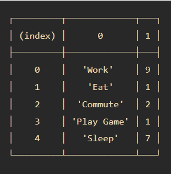

# JavaScript

## Array
Array adalah tipe data list order yang dapat menyimpan tipe data apapun di dalamnya. Di javascript array dapat menyimpan berbagai tipe data seperti String, Number, Boolean, dan lainnya. <br>
Contoh:
```javascript
// Array didefinisikan menggunakan square brackets
let randomData = ["Alief", 100, true]
console.log(randomData)
```
Array pada javascript dihitung dari index data ke-0. Data pertama adalah index ke-0. Cara memanggil array:
```javascript
let siswa = ["Alief", "Bagus", "Rizky"]
console.log(siswa[1]) // Bagus
```
Kita juga bisa mengupdate atau mengubah data pada array, bahkan jika dideklarasikan menggunakan const.
```javascript
const siswa = ["Alief", "Bagus", "Rizky"]
siswa[1] = "Fernanda"
console.log(siswa[1]) // Fernanda
```
Salah satu properties pada array yaitu .length. Properties ini akan mengembalikan nilai dari jumlah panjang data suatu array.
```javascript
const siswa = ["Alief", "Bagus", "Fernanda", "Rizky"]
console.log(siswa.length) // 4
```

## Array Method
Array memiliki method atau biasa disebut built-in methods. Artinya Javascript sudah memudahkan kita dengan menyediakan function atau method umum yang bisa kita gunakan.
- .push()<br>
.push() adalah method untuk menambahkan item array pada index yang paling akhir.
    ```javascript
    let siswa = ["Alief", "Bagus", "Fernanda", "Rizky"]
    siswa.push("Wulan")
    console.log(siswa)
    // (5) ['Alief', 'Bagus', 'Fernanda', 'Rizky', 'Wulan']
    ```
- .pop()<br>
.pop() adalah method untuk menghapus item array pada index yang paling akhir.
    ```javascript
    let siswa = ["Alief", "Bagus", "Fernanda", "Rizky"]
    siswa.pop()
    console.log(siswa)
    // (3) ['Alief', 'Bagus', 'Fernanda']
    ```
- .unshift()<br>
.unshift() adalah method untuk menambahkan item array pada index pertama.
    ```javascript
    let siswa = ["Alief", "Bagus", "Fernanda", "Rizky"]
    siswa.unshift("Abil")
    console.log(siswa)
    // (3) ['Abil', 'Alief', 'Bagus', 'Fernanda', 'Rizky']
    ```
- .shift()<br>
.shift() adalah method untuk menghapus item array pada index pertama.
    ```javascript
    let siswa = ["Alief", "Bagus", "Fernanda", "Rizky"]
    siswa.shift()
    console.log(siswa)
    // (3) ['Bagus', 'Fernanda', 'Rizky']
    ```

## Looping pada Array
Array memiliki built in methods untuk melakukan looping yaitu .map() dan .forEach().
- .forEach()<br>
.forEach() adalah method untuk melakukan looping pada setiap elemen array.
    ```javascript
    let cars = ['Honda', 'Toyota', 'Nissan']
    cars.forEach(element => {
        console.log(element)
        // 'Honda', 'Toyota', 'Nissan'
    })
    ```
- .map()<br>
map() melakukan perulangan/looping dengan membuat array baru.
    ```javascript
    let number = [1, 2, 3, 4]
    let doubled = number.map(element => {
        return element *2
    })
    console.log(doubled)
    // (4) [2, 4, 6, 8]
    ```
Kita bisa lihat bahwa .map() dan forEach() sama-sama melakukan looping dan mengembalikan nilai baru dari operasi yang dilakukan. Perbedaannya adalah .forEach tidak dapat membuat array baru dari hasil operasi yang ada dalam looping. Jadi, gunakan .forEach() jika hanya memerlukan looping untuk menampilkan saja atau menyimpan ke database. Gunakan .map() jika akan melakukan operasi pada array seperti yang dapat mengubah nilai array sebelumnya.

## Multidimensional Array
Multidimensional Array bisa dianalogikan dengan array of array atau ada array di dalam array. Bayangkan multidimensional ini seperti tabel. Baris pada tabel itu menunjukan jumlah array. Column pada tabel itu menunjukan isi dari tiap array.

```javascript
let inventory = [
    ['Simpati', 10],
    ['IM3', 18],
    ['Axis', 5],
    ['XL', 21]
]
console.log(inventory)
// 0 : ['Simpati', 10]
// 1 : ['IM3', 18]
// 2 : ['Axis', 5]
// 3 : ['XL', 21]

// Cara mengakses multidimensional array
console.log(inventory[0][1]) // 10
```
Sama seperti array satu dimensi, multidimensional array juga dapat menggunakan Property dan Method built-in Array.
```javascript
let inventory = [
    ['Simpati', 10],
    ['IM3', 18],
    ['Axis', 5],
    ['XL', 21]
]
inventory.push(['Smartfren', 12])
console.log(inventory)
// ['Simpati', 10]
// ['IM3', 18]
// ['Axis', 5]
// ['XL', 21]
// ['Smartfren', 12]

let inventory = [
    ['Simpati', 10],
    ['IM3', 18],
    ['Axis', 5],
    ['XL', 21]
]
let a = inventory.map(dataInven => {
    let terjual = 100 - dataInven[1]
    return terjual
})
console.log(a)
```