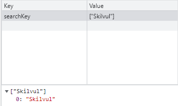

# JavaScript

## Array
Array adalah tipe data list order yang dapat menyimpan tipe data apapun di dalamnya. Di javascript array dapat menyimpan berbagai tipe data seperti String, Number, Boolean, dan lainnya. <br>
Contoh:
```javascript
// Array didefinisikan menggunakan square brackets
let randomData = ["Alief", 100, true]
console.log(randomData)
```
Array pada javascript dihitung dari index data ke-0. Data pertama adalah index ke-0. Cara memanggil array:
```javascript
let siswa = ["Alief", "Bagus", "Rizky"]
console.log(siswa[1]) // Bagus
```
Kita juga bisa mengupdate atau mengubah data pada array, bahkan jika dideklarasikan menggunakan const.
```javascript
const siswa = ["Alief", "Bagus", "Rizky"]
siswa[1] = "Fernanda"
console.log(siswa[1]) // Fernanda
```
Salah satu properties pada array yaitu .length. Properties ini akan mengembalikan nilai dari jumlah panjang data suatu array.
```javascript
const siswa = ["Alief", "Bagus", "Fernanda", "Rizky"]
console.log(siswa.length) // 4
```

## Array Method
Array memiliki method atau biasa disebut built-in methods. Artinya Javascript sudah memudahkan kita dengan menyediakan function atau method umum yang bisa kita gunakan.
- .push()<br>
.push() adalah method untuk menambahkan item array pada index yang paling akhir.
    ```javascript
    let siswa = ["Alief", "Bagus", "Fernanda", "Rizky"]
    siswa.push("Wulan")
    console.log(siswa)
    // (5) ['Alief', 'Bagus', 'Fernanda', 'Rizky', 'Wulan']
    ```
- .pop()<br>
.pop() adalah method untuk menghapus item array pada index yang paling akhir.
    ```javascript
    let siswa = ["Alief", "Bagus", "Fernanda", "Rizky"]
    siswa.pop()
    console.log(siswa)
    // (3) ['Alief', 'Bagus', 'Fernanda']
    ```
- .unshift()<br>
.unshift() adalah method untuk menambahkan item array pada index pertama.
    ```javascript
    let siswa = ["Alief", "Bagus", "Fernanda", "Rizky"]
    siswa.unshift("Abil")
    console.log(siswa)
    // (3) ['Abil', 'Alief', 'Bagus', 'Fernanda', 'Rizky']
    ```
- .shift()<br>
.shift() adalah method untuk menghapus item array pada index pertama.
    ```javascript
    let siswa = ["Alief", "Bagus", "Fernanda", "Rizky"]
    siswa.shift()
    console.log(siswa)
    // (3) ['Bagus', 'Fernanda', 'Rizky']
    ```

## Looping pada Array
Array memiliki built in methods untuk melakukan looping yaitu .map() dan .forEach().
- .forEach()<br>
.forEach() adalah method untuk melakukan looping pada setiap elemen array.
    ```javascript
    let cars = ['Honda', 'Toyota', 'Nissan']
    cars.forEach(element => {
        console.log(element)
        // 'Honda', 'Toyota', 'Nissan'
    })
    ```
- .map()<br>
map() melakukan perulangan/looping dengan membuat array baru.
    ```javascript
    let number = [1, 2, 3, 4]
    let doubled = number.map(element => {
        return element *2
    })
    console.log(doubled)
    // (4) [2, 4, 6, 8]
    ```
Kita bisa lihat bahwa .map() dan forEach() sama-sama melakukan looping dan mengembalikan nilai baru dari operasi yang dilakukan. Perbedaannya adalah .forEach tidak dapat membuat array baru dari hasil operasi yang ada dalam looping. Jadi, gunakan .forEach() jika hanya memerlukan looping untuk menampilkan saja atau menyimpan ke database. Gunakan .map() jika akan melakukan operasi pada array seperti yang dapat mengubah nilai array sebelumnya.

## Multidimensional Array
Multidimensional Array bisa dianalogikan dengan array of array atau ada array di dalam array. Bayangkan multidimensional ini seperti tabel. Baris pada tabel itu menunjukan jumlah array. Column pada tabel itu menunjukan isi dari tiap array.

```javascript
let inventory = [
    ['Simpati', 10],
    ['IM3', 18],
    ['Axis', 5],
    ['XL', 21]
]
console.log(inventory)
// 0 : ['Simpati', 10]
// 1 : ['IM3', 18]
// 2 : ['Axis', 5]
// 3 : ['XL', 21]

// Cara mengakses multidimensional array
console.log(inventory[0][1]) // 10
```
Sama seperti array satu dimensi, multidimensional array juga dapat menggunakan Property dan Method built-in Array.
```javascript
let inventory = [
    ['Simpati', 10],
    ['IM3', 18],
    ['Axis', 5],
    ['XL', 21]
]
inventory.push(['Smartfren', 12])
console.log(inventory)
// ['Simpati', 10]
// ['IM3', 18]
// ['Axis', 5]
// ['XL', 21]
// ['Smartfren', 12]

let inventory = [
    ['Simpati', 10],
    ['IM3', 18],
    ['Axis', 5],
    ['XL', 21]
]
let a = inventory.map(dataInven => {
    let terjual = 100 - dataInven[1]
    return terjual
})
console.log(a)
```

## Object
Object adalah sebuah tipe data pada variabel yang menyimpan properti/key dan value/fungsi (method). Properti adalah data lengkap dari sebuah object. Method adalah action dari sebuah object. Apa saja yang dapat dilakukan dari suatu object. Object termasuk tipe data non-primitive. Object dapat diassign kedalam sebuah variabel. Sama seperti array, didalam object kita dapat menyimpan properti dengan tipe data apapun.
```javascript
let buku = {
    judul: 'Cantik itu Luka',
    penulis: 'Eka Kurniawan',
    tahun: 2002,
}
```

## Mengakses Object dan Property Object
```javascript
let buku = {
    judul: 'Cantik itu Luka',
    penulis: 'Eka Kurniawan',
    tahun: 2002,
}

// Mengakses seluruh object
console.log(buku)
```
Untuk mengakses properti object ada dua cara:
- Dot Notation
    ```javascript
    let buku = {
        judul: 'Cantik itu Luka',
        penulis: 'Eka Kurniawan',
        tahun: 2002,
    }  

    // Memanggil variabel dengan properti
    console.log(buku.judul) // Cantik itu Luka
    ```
- Bracket Notation
    ```javascript
    let buku = {
        judul: 'Cantik itu Luka',
        penulis: 'Eka Kurniawan',
        "tahun terbit": 2002,
    }  

    console.log(buku['tahun terbit']) // 2002
    ```

## Update Object
Kita dapat melakukan update pada variabel dengan tipe data Object. Object dapat mengupdate value dari key yang sudah tersedia. Object juga dapat menambahkan key dan value baru.
```javascript
let buku = {
    judul: 'Cantik itu Luka',
    penulis: 'Eka Kurniawan',
    "tahun terbit": 2002,
}  

buku.penulis = "Eka Fuzianti"
buku.penerbit = "Gramedia"


console.log(buku)
// judul: "Cantik itu Luka"
// penerbit: "Gramedia"
// penulis: "Eka Fuzianti"
// tahun terbit: 2002
```
Jika menggunakan const pada variable object, kita tidak bisa mengganti seluruh data object dengan object yang baru. Akan tetapi jika mengganti value dari key masih bisa.
```javascript
const buku = {
    judul: 'Cantik itu Luka',
    penulis: 'Eka Kurniawan',
    "tahun terbit": 2002,
}  

buku = {
    title: 'Earth'
}

console.log(buku) // Uncaught TypeError: Assignment to constant variable.
```
Jadi jika membutuhkan untuk update seluruh data object gunakan ‘let’ pada saat deklarasi variabel.

## Delete Object Property
Kita dapat menghapus properti dari object menggunakan delete operator.
```javascript
let buku = {
    judul: 'Cantik itu Luka',
    penulis: 'Eka Kurniawan',
    "tahun terbit": 2002,
} 

delete buku.penulis

console.log(buku)
// judul: "Cantik itu Luka"
// tahun terbit: 2002
```

## Method Object
Jika value yang kita masukkan pada property berupa function, maka itu disebut method. Kita bisa membuat method custom untuk kita gunakan sesuai kebutuhan.
```javascript
let greeting = {
    welcome: function(){
        return "Hai, selamat datang"
    }
}

console.log(greeting.welcome()) // "Hai, selamat datang"
```

## Nested Object
Pada real application nanti kalian pasti menemukan data object yang kompleks. Object yang berasal dari turunan object lainnya. Atau simpelnya adalah object di dalam object.
```javascript
let buku = {
    judul: "Intro to Data Mining",
    tahun: "2018",
    penulis: {
        penulis1:{
            nama: "Eka Kurniawan",
            umur: 20
        },
        penulis2:{
            nama: "Fauzan Al-Haq",
            umur: 21
        }
    }
}

console.log(buku.penulis.penulis1.nama)
// "Eka Kurniawan"
```

## Looping Object
Jika kita ingin menampilkan seluruh object properti. Kita bisa menggunakan looping. Jadi tidak perlu mengakses secara manual memanggil setiap propertinya. Caranya menggunakan for...in.
```javascript
let buku = {
    judul: "Intro to Data Mining",
    tahun: "2018",
    penulis: {
        penulis1:{
            nama: "Eka Kurniawan",
            umur: 20
        },
        penulis2:{
            nama: "Fauzan Al-Haq",
            umur: 21
        }
    }
}

for(let data in buku){
    console.log(buku[data])
    // Intro to Data Mining
    // 2018
    // {penulis1: {…}, penulis2: {…}} 
}

for(let data in buku.penulis.penulis2){
    console.log(buku.penulis.penulis2[data]);
    // Fauzan Al-Haq
    // 21
}
```

## Array of Object
Object sama seperti Array yang bisa menyimpan banyak data. Kita dapat menggunakan array untuk menyimpan banyak object.
```javascript
let siswa = [
    {
        nama: 'Rizky',
        umur: 17,
        isVerified: true
    },
    {
        nama: 'Fauzan',
        umur: 16,
        isVerified: true
    },
    {
        nama: 'Abi',
        umur: 18,
        isVerified: true
    }
]

// Gunakan forEach jika object berada di dalam array
siswa.forEach((listSiswa) =>{
    console.log(listSiswa)
    // {nama: 'Rizky', umur: 17, isVerified: true}
    // {nama: 'Fauzan', umur: 16, isVerified: true}
    // {nama: 'Abi', umur: 18, isVerified: true}
})
```

## Modules
Modules adalah reusable code yang dapat di-export dari suatu file javascript dan di-import ke file javascript yang lain. Reusable code di sini adalah data yang dapat digunakan berulang kali. Kita dapat melakukan export pada data apapun seperti string, object, array, number, class, hingga function.<br>
Kenapa harus membuat modules ?
- Mudah menemukan dan mengatasi debug pada program.
- Membuat program menjadi komponen-komponen kecil sehingga code lebih mudah dibaca dan dimengerti.
- Reusable code.<br>

Sebelum menggunakan export import untuk membuat modules, ada beberapa syarat yang harus disiapkan. Saat menjalankan modules, kita tidak bisa menggunakan url local komputer kita di browser. Gunakan extension Live Server pada Vscode. Lalu pada file HTML kita harus menambahkan script attribute type untuk modules.
```html
<script src="script.js" type="module"></script>
```
Kita akan mencoba membuat modules. Buat file index.html, indonesia.js dan jepang.js.
```html
// Kita taruh file indonesia.js sebagai javascript utama
<!DOCTYPE html>
<html lang="en">
<head>
    <meta charset="UTF-8">
    <meta http-equiv="X-UA-Compatible" content="IE=edge">
    <meta name="viewport" content="width=device-width, initial-scale=1.0">
    <title>Document</title>
    <script src="indonesia.js" type="module" defer></script>
</head>
<body>
    
</body>
</html>
```
```javascript
// Isi file jepang.js
// Kita export variabel motor agar bisa digunakan js yang lain
export let motor = ['honda', 'yamaha', 'kawasaki', 'suzuki']

// Isi file indonesia.js
// Kita import variabel motor dari jepang.js
// Kita bisa mengganti nama variabel menggunakan keyword as
import {motor as motorJepang} from './jepang.js'
console.log(motorJepang);
// ['honda', 'yamaha', 'kawasaki', 'suzuki']
```
Ada cara lain untuk melakukan export.
```javascript
let motor = ['honda', 'yamaha', 'kawasaki', 'suzuki']

export{motor}
```
Saat melakukan export, kita bisa mengganti nama dari function, variabel, data lainnya menggunakan keyword as.
```javascript
let motor = ['honda', 'yamaha', 'kawasaki', 'suzuki']

export{motor as motorJepang}
```
Ada juga yang namanya export default. Export default hanya bisa digunakan untuk 1 data yang ingin kita export. 
```javascript
// Isi file jepang.js
export let motor = ['honda', 'yamaha', 'kawasaki', 'suzuki']
let entertainment = ['anime', 'manga', 'light novel', 'action figure']
export default{entertainment}

// Isi file indonesia.js
// Pemanggilan untuk export default berbeda dengan export biasa
import entertainment, {motor as motorJepang} from './jepang.js'
console.log(motorJepang);
console.log(entertainment);
```

## Rekursif
Rekursif adalah adalah function yang memanggil dirinya sendiri sampai kondisi tertentu. Rekursif kebanyakan digunakan untuk case matematika, fisika, kimia, dan yang berhubungan dengan calculation.<br>
Ciri dari rekursif:
- Fungsi rekursif selalu memiliki kondisi yang menyatakan kapan fungsi tersebut berhenti.
- Fungsi rekursif selalu memanggil dirinya sendiri sambil mengurangi atau memecahkan data masukan setiap panggilannya.

Pada rekursif terdapat 2 kondisi:
- Base case yaitu kondisi berhenti.
- Recursive case yaitu kondisi untuk memanggil diri sendiri.
Contoh kasus kita akan menampilkan urutan bilangan 1 hingga 5.
```javascript
function deretAngka(n){
    // Base case
    if(n == 1){
        console.log(n);
    }
    // Recursive case
    else{
        deretAngka(n-1)
        console.log(n);
    }
}

deretAngka(5) 
// Output
// 1
// 2
// 3
// 4
// 5
```

## Asynchronous JavaScript
Asynchronous programming adalah teknik yang memungkinkan suatu program untuk memulai suatu task yang berpotensi berjalan lama dan masih dapat responsif terhadap events lain saat task tersebut masih berjalan, daripada user harus menunggu hingga task tersebut selesai. Setelah task selesai, program akan ditampilkan dengan hasilnya. Sedangkan program yang dijalankan satu baris pada satu waktu, sesuai dengan urutan dan harus menunggu proses selesai sebelum melanjutkan ke proses selanjutnya disebut synchronous program.
```javascript
// Contoh Synchronous
const name = 'Miriam'; // Kerjakan kode ini terlebih dahulu
const greeting = `Hello, my name is ${name}!`; // Setelah pada baris sebelumnya telah selesai barulah eksekusi baris ini
console.log(greeting); // Kemudian yang terakhir baris ini
// "Hello, my name is Miriam!"
```
Asynchronous sangat penting, pastinya kita tidak mau user yang menggunakan program harus menunggu lama agar website kita termuat sepenuhnya, dengan menerapkan asynchronous user dapat berinteraksi atau melakukan hal lain pada website tanpa perlu menunggu hingga selesai termuat.<br>
Javascript merupakan bahasa pemrograman single thread, non-blocking, dan asynchronous. Single thread maksudnya ia hanya memiliki satu jalur untuk menyelesaikan task. Ada juga multi thread yang artinya memiliki banyak jalur untuk menyelesaikan task.
Non-blocking artinya antrian task tidak harus berurut dan dapat disela. Misalnya, ada task A dan task B, task A butuh waktu lama agar prosesnya selesai, maka task B bisa mendahului task A.

## setTimeout()
Function setTimeout() digunakan untuk membuat sebuah output dalam waktu yang ditentukan dalam satuan waktu milisecond. setTimeout() juga bisa digunakan untuk mengatur seberapa lama interval waktu yang diperlukan untuk sebuah variabel dieksekusi atau muncul di layar.
```javascript
console.log("A"); 
console.log("B"); 
console.log("C"); 
// Output
// A
// B
// C

console.log("A");
setTimeout(() => {
    console.log("B");
}, 1000)
console.log("C");
// Output
// A
// C
// B, interval waktu untuk ditampilkan sebesar 1000 milisecond
```

## Callback
Callback adalah sebuah function yang diteruskan ke function lain atau function yang menjadi parameter function lain. Callback dulunya merupakan cara utama penerapan fungsi asynchronous dalam javascript. Namun, kode berbasis callback bisa menjadi sulit dimengerti ketika callback harus memanggil function yang menerima callback juga.
```javascript
function myDisplayer(some){
    console.log(some);
}
function myGreeting(){
    myDisplayer("Hellow")
}

myGreeting() // "Hellow"
```

## Promise
Promise adalah dasar dari pemrograman asynschronous dalam JavaScript modern. Promise adalah sebuah objek yang dikembalikan oleh function asynchronous. Pada saat promise dikembalikan ke caller, operasi sering kali belum selesai, tetapi objek promise menyediakan metode untuk menangani keberhasilan atau kegagalan operasi.
```javascript
let nontonPromise = new Promise((resolve, reject) => {
    resolve('Nonton terpenuhi')
    reject('Gagal nonton')
})

nontonPromise
    .then(result => {console.log(result);}) // 'Nonton terpenuhi'
    .catch(error => {console.log(error);}) // Catch untuk menangkap reject
```

## Web Storage
Ada beberapa cara untuk menyimpan data pengguna seperti pencarian, artikel berita, dan lain-lain ke lokal (browser) menggunakan web storage seperti cookies, local storage, dan session storage. Data ini dimanfaatkan oleh situs web tersebut untuk merekam kebiasaan pengguna agar dapat memberikan rekomendasi sesuai preferensi si pengguna tersebut. Objek localStorage dan sessionStorage, bagian dari API penyimpanan web, adalah dua tools hebat untuk menyimpan pasangan data secara lokal. Menggunakan localStorage dan sessionStorage untuk penyimpanan adalah alternatif selain menggunakan cookie dan memiliki beberapa keunggulan:
- Data hanya disimpan secara lokal dan tidak dapat dibaca oleh server, yang menghilangkan masalah keamanan yang disebabkan oleh cookie.
- Ini memungkinkan lebih banyak data disimpan (10mb untuk sebagian besar browser).
- Sintaksnya straightforward atau langsung.

## Coookies
Cookies diperkenalkan ke web untuk menjaga informasi tetap tentang pengguna. Cookies adalah string yang memiliki atribut nama, atribut nilai, dan atribut opsional tambahan. Cookie dapat menyimpan hingga 4096 byte data (ini termasuk nama, nilai, domain, tanggal kedaluwarsa, dan apa pun yang Anda muat di sana). Anda dapat menambahkan cookie dalam jumlah terbatas per domain yang berubah tergantung pada browser Anda.<br>
Namun ada beberapa kekurangan yang perlu kita perhatikan mengenai cookies di antaranya:<br>
- Setiap kita mengakses situs web, cookies juga kembali dikirim sehingga memperlambat aplikasi web kamu dengan mengirimkan data yang sama.
- Cookies disertakan pada setiap HTTP request, sehingga mengirimkan data yang tidak dienkripsi melalui internet, maka saat kita ingin menyimpan data dalam cookies kita harus mengenkripsinya terlebih dahulu.
- Cookies hanya dapat menyimpan data sebanyak 4KB.
- Lalu cookies juga memiliki tanggal kadaluarsa. Tanggal ini telah ditentukan sehingga web browser bisa menghapus cookies jika tanggal sudah kadaluarsa atau tidak dibutuhkan.

## Local Storage
Local storage memiliki karakteristik sebagai berikut:
- Menyimpan data tanpa tanggal kadaluarsa.
- Data tidak akan dihapus ketika web browser ditutup dan akan tersedia seterusnya selama kita tidak menghapus data local storage pada web browser.
- Dapat menyimpan data hingga 5MB.
- Hanya dapat menyimpan data string.

1. Menyimpan Data<br>
Untuk menyimpan data pada local storage, kita menggunakan method setItem() yang membutuhkan 2 parameter. Parameter pertama adalah key yang ingin kita simpan dan parameter kedua adalah data (value) dari key yang akan disimpan.
    ```javascript
    localStorage.setItem('key', value)
    ```
    Kita akan membuat web sederhana dengan fitur search. Pertama buat file HTML nya.
    ```html
        <html lang="en">
            <head>
                <meta charset="UTF-8">
                <meta http-equiv="X-UA-Compatible" content="IE=edge">
                <meta name="viewport" content="width=device-width, initial-scale=1.0">
                <title>Document</title>
                <SCript src="script.js" defer></SCript>
            </head>
            <body>
                <form action="">
                    <input type="text" id="searchKey">
                    <input type="submit" id="searchSumbit" onclick="">
                </form>
            </body>
            </html>        
    ```
    Kemudian pada file javascript isi seperti di bawah ini.
    ```javascript
    var searchList = []
    function onSearch(){
        let searchValue = document.getElementById('searchKey').value
        searchList.push(searchValue)

        let searchListString = JSON.stringify(searchList) // mengubah array menjadi string
        localStorage.setItem('searchKey', searchListString) // menyimpan pencarian dengan key 'searchKey'
    }
    ```
    Outputnya bisa dilihat pada browser, kemudian inspect element, pilih tab application dan local storage.
    

2. Mengambil Data<br>
Untuk mengambil data yang telah tersimpan pada local storage, kita dapat menggunakan method getItem() yang membutuhkan 1 parameter. Parameter tersebut adalah key dari data yang kita inginkan.
    ```javascript
    localStorage.getItem('key');
    ```
    Kita akan melanjutkan aplikasi search yang telah dibuat. Kita akan menambahkan beberapa elemen untuk menampilkan riwayat pencarian
    ```html
    <html lang="en">
    <head>
        <meta charset="UTF-8">
        <meta http-equiv="X-UA-Compatible" content="IE=edge">
        <meta name="viewport" content="width=device-width, initial-scale=1.0">
        <title>Document</title>
        <SCript src="script.js" defer></SCript>
    </head>
    <body>
        <form action="">
            <input type="text" id="searchKey">
            <input type="submit" id="searchSumbit" onclick="onSearch()">
        </form>
        <div id="search-history"></div>
    </body>
    </html>
    ```
    Kemudian pada file javascript kita buat fungsi getSearchHistory dan menggunakan method getItem().
    ```javascript
    var searchList = []
    function onSearch(){
        let searchValue = document.getElementById('searchKey').value
        searchList.push(searchValue)

        let searchListString = JSON.stringify(searchList) // mengubah array menjadi string
        localStorage.setItem('searchKey', searchListString) // menyimpan pencarian dengan key 'searchKey'
    }

    var searchList = JSON.parse(localStorage.getItem("searchKey")) || []
    function getSearchHistory(){
        var list = ''
        for(var i = 0; i < searchList.length; i++){
            list += `<div>${searchList[i]}</div>`
        }
        document.getElementById('search-history').innerHTML = list
    }
    if (searchList.length > 0) {  // Jika panjang array searchList > 0
        getSearchHistory(); // panggil fungsi getSearchHistory
    }    
    ```
    Hasilnya seperti ini:<br>
    

3. Menghapus Data<br>
Untuk menghapus data yang telah tersimpan pada local storage, kita dapat menggunakan method removeItem() yang membutuhkan 1 parameter. Parameter tersebut adalah key dari data yang ingin kita hapus.
    ```javascript
    // menghapus key tertentu
    localStorage.removeItem("key");

    // menghapus semua key
    localStorage.clear();
    ```
    Kita akan tambahkan button hapus riwayat pada file HTML dengan atribut onClick memiliki value fungsi clearSearchHistory().
    ```javascript
    function clearSearchHistory(){
        localStorage.removeItem('searchKey')
        document.getElementById('search-history').innerHTML = ''
    }
    ``` 

## Session Storage
Berbeda dengan local storage, walaupun masuk ke dalam web storage, data yang tersimpan pada session storage akan hilang ketika session dari sebuah laman berakhir.<br>
Session storage mempunyai beberapa karakteristik, yaitu:
- Data yang disimpan pada session storage akan terus tersimpan selama browser terbuka dan tidak hilang jika laman di-reload.
- Membuka banyak tab/window dengan URL yang sama, akan menciptakan session storage yang berbeda di masing-masing tab/window.
- Menutup tab/window akan mengakhiri session dan menghapus data yang tersimpan di session storage pada tab/window tersebut.
- Data yang tersimpan dalam session storage harus berbentuk string.
- Hanya dapat menyimpan data sebanyak 5MB.

1. Menyimpan Data<br>
Sama dengan local storage, sintaks untuk menyimpan data pada session storage adalah sebagai berikut:
    ```javascript
    // menambah session storage
    sessionStorage.setItem('key', value);
    ```

2. Mengambil Data<br>
Sama seperti local storage, cara mendapatkan data dari session storage juga menggunakan getItem(), seperti berikut ini:
    ```javascript
    // mendapatkan session storage
    sessionStorage.getItem('key')
    ```

3. Menghapus Data<br>
Syntax untuk menghapus data dari session storage ada 2, yaitu:
    ```javascript
    // menghapus session storage satu persatu berdasarkan key
    sessionStorage.removeItem('key');

    // menghapus seluruh session storage sekaligus
    sessionStorage.clear();
    ```