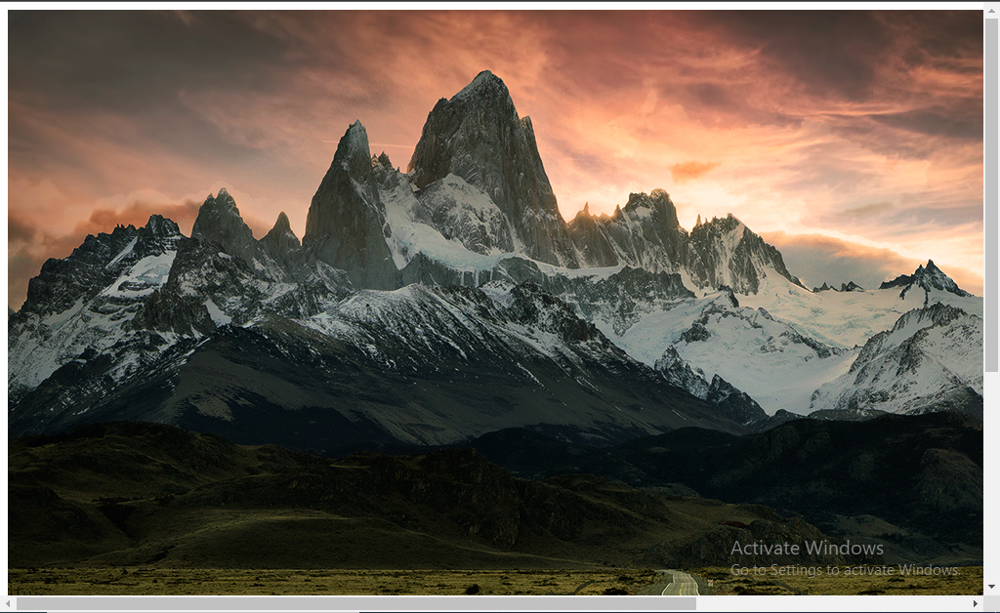
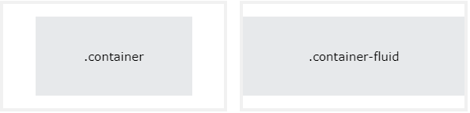

# **JavaScript**

## **Async and Await**
Selain menggunakan callback dan promise, kita juga bisa menggunakan async/await untuk menggunakan asynchronous pada JavaScript. Sebenarnya async/await dan promise itu sama saja, namun hanya berbeda dari syntax dan cara penggunaannya. Dengan keyword async kita diberikan cara yang lebih sederhana untuk membuat kode asynchronous berbasis promise. Menambahkan async di awal function menjadikannya async function:
```javascript
async function myFunction() {
  // Ini adalah async function
}
```
Di dalam async function, kita dapat menggunakan keyword await sebelum melakukan call ke function yang mengembalikan promise. Ini membuat kode menunggu hingga promise diselesaikan, di mana nilai yang dipenuhi dari promise diperlakukan sebagai return value, atau rejected value dibuang.<br>
Sebuah async function bisa tidak berisi await sama sekali atau lebih dari satu await. Keyword await hanya bisa digunakan didalam async function, jika digunakan di luar async function maka akan terjadi error.
```javascript
// Dengan cara membuat function biasa
async function tesAsyncAwait(){
    return "Fullfilled"
}
console.log(tesAsyncAwait());

// Dengan menggunakan arrow function
let tesAsyncAwait2 = async () => {
    return "Fullfilled"
}
console.log(tesAsyncAwait2());
```
Kita juga bisa memberikan error handling pada async/await. Contoh lengkap penggunaan async/await:
```javascript
// Definisikan promise yang akan digunakan
let nonton = async (condition) => {
    if(condition){
        return "Nonton terpenuhi"
    } else{
        throw "Gagal nonton"
    }
}

// Membuat fungsi run menjadi asynchronous menggunakan async/await
async function run(condition){
    try{
        const message = await nonton(condition)
        console.log(message);
    } catch(error){
        console.log(error);
    }
}

run(true)
```

## **JSON**
JSON, kependekan dari JavaScript Object Notation, adalah format untuk berbagi data. Seperti namanya, JSON berasal dari bahasa pemrograman JavaScript, tetapi tersedia untuk digunakan oleh banyak bahasa termasuk Python, Ruby, PHP, dan Java. JSON juga dapat dibaca, ringan, menawarkan alternatif yang baik untuk XML, dan membutuhkan lebih sedikit pemformatan.<br>
JSON menggunakan ekstensi .json saat berdiri sendiri, dan saat didefinisikan dalam format file lain (seperti dalam .html), ekstensi tersebut dapat muncul di dalam tanda kutip sebagai string JSON, atau dapat berupa objek yang ditetapkan ke variabel. Format ini mentransmisikan antara server web dan klien atau browser. Objek JSON adalah format data nilai kunci yang biasanya dirender dalam kurung kurawal.<br>
Berikut adalah contoh objek JSON:
```javascript
{
  "first_name" : "Sammy",
  "last_name" : "Shark",
  "location" : "Ocean",
  "online" : true,
  "followers" : 987 
}
```

## **Fetch**
Fetch API menyediakan antarmuka JavaScript untuk mengakses dan memanipulasi bagian protokol, seperti request dan responses. Ini juga menyediakan metode fetch() global yang menyediakan cara mudah dan logis untuk mengambil sumber daya secara asinkron di seluruh jaringan.<br>
Contoh network request yang biasa kita lakukan:
- Mengirimkan data dari sebuah form.
- Mengambil data untuk ditampilkan dalam list/table.
- Mendapatkan notifikasi.

Proses melakukan fetch() adalah salah satu proses asynchronous di JavaScript sehingga kita perlu menggunakan salah satu di antara promise atau async/await.

Request fetch dasar itu sangat simpel menggunakan promise. Perhatikan kode berikut:
```javascript
fetch('http://example.com/movies.json')
  .then((response) => response.json())
  .then((data) => console.log(data));
```
Berikut ini contoh request data dengan fetch() menggunakan promise:
```javascript
fetch("https://jsonplaceholder.typicode.com/posts")
    .then(response => response.json()) // untuk unboxing data
    .then(data => console.log(data))
    .catch(error => console.log(error))
```
Berikut contoh request data dengan fetch() menggunakan async/await:
```javascript
let testFetchAsync = async () => {
    try {
        let response = await fetch("https://jsonplaceholder.typicode.com/posts")
        response = await response.json() // untuk unboxing data
        console.log(response);
    } catch (error) {
        console.log(error);
    }
}
testFetchAsync()
```

## **Git & GitHub Lanjutan**

### **Git Branch**
Fitur yang wajib digunakan jika ingin berkolaborasi dengan developer atau dalam tim yaitu git branch. Untuk menghindari conflict code, kita tidak boleh berkolaborasi dalam project di satu branch yang sama.<br>
Analoginya, misal Chea akan mengerjakan fitur A dan Rizky mengerjakan fitur B. Masing-masing fitur tersebut harus dibuat branch masing-masing. Tidak boleh mengganggu branch master yang sudah terupdate.

Untuk membuat branch, bisa menggunakan command berikut.
```
git branch <branch>
```
Misal kita ingin membuat fitur login.
```
git branch fitur_login
```
Untuk melihat list branch yang dibuat.
```
git branch
```
Pindah ke branch tertentu.
```
// Menggunakan checkout atau switch
git checkout <branch>
git switch <branch>
```

### **Git Merge**
Setelah membuat branch baru, lalu lakukan commit, saatnya kita menyatukan pekerjaan ke branch utama. Untuk menyatukan branch cabang fitur yang telah kita kembangkan. Gunakan perintah seperti berikut ini:<br>
1. Checkout dahulu ke branch utama.
    ```
    git checkout <branch>
    ```
2. Lalu lakukan merge.
    ```
    git merge <fitur>
    ```

### **Langkah-langkah Kolaborasi di GitHub**
1. Siapkan respository, boleh repository pribadi atau organization. Lebih baik menggunakan organization.
2. Team leader membuat organizationnya terlebih dahulu.
3. Undang anggota tim ke organization dan jadikan owner.
4. Team leader buat repository pada organization. Repo dibuat public dan ceklis README.
5. Pada repository buat branch bernama dev. Branch main sebagai branch utama sedangkan branch dev ini sebagai branch untuk development.
6. Masing-masing anggota melakukan clone pada repository yang sudah dibuat (1x saja).
7. Bagi tugas pada masing-masing anggota tim.
8. Sebelum membuat perubahan atau ngoding, lakukan git pull untuk mendapatkan kode terbaru.
9. Anggota membuat branch dari dev berdasarkan tugas masing-masing.
10. Lakukan pengerjaan di dalam branch yang sudah dibuat.
11. Jika fitur sudah selesai, lakukan commit seperti biasa.
12. Sebelum push branch, lakukan git merge dev untuk menghindari conflict di github. 
13. Jika ada conflict, maka selesaikan conflictnya. Jika sudah aman, push branch ke github.
14. Lakukan pull request untuk melakukan merge ke branch dev. Pull request adalah permintaan untuk menggabungkan antara branch yang kita buat ke branch development atau branch yang lain.
15. Tunggu pull request di-acc oleh team leader. Hanya team leader yang bisa acc pull request.

### **Merge Conflict**
Conflict terjadi ketika lebih dari satu orang mengerjakan atau mengutak-atik satu file yang sama. Cara solve conflict:
1. Pastikan branch development di anggota yang mengalami conflict sudah up to date.
2. Lakukan merge pada branch development di branch yang mengalami conflict.\
3. Conflict yang terjadi akan muncul, kita akan diminta untuk memilih perubahan mana yang akan digunakan, antara lain current changes, incoming changes atau kita bisa mengambil kedua perubahannya. 
4. Setelah dipilih lakukan commit branch.
5. Maka merge pull request sudah bisa dilakukan.

## **Responsive Web Design**
Responsive Web Design adalah desain website yang dapat diakses dalam device apapun. Dalam membuat aplikasi kita harus memikirkan user yang akan menggunakannya. Device yang umumnya digunakan saat ini adalah laptop/PC, smartphone, dan tablet. Setiap developer website wajib menggunakan tools bawaan dari setiap browser yang memudahkan proses development website. Pada browser chrome bisa menggunakan Chrome Dev Tools.

### **Viewport**
Viewport adalah area halaman web yang terlihat oleh pengguna. Viewport bervariasi menurut device dan akan lebih kecil di ponsel daripada di layar komputer. Sebelum tablet dan ponsel ada, halaman web dirancang hanya untuk layar komputer, dan halaman web biasanya memiliki desain statis dan ukuran tetap. Kemudian, ketika orang-orang mulai berselancar di internet menggunakan tablet dan ponsel, halaman web berukuran tetap terlalu besar untuk muat di viewport. Untuk memperbaikinya, browser pada perangkat tersebut memperkecil seluruh halaman web agar sesuai dengan layar device.

HTML5 memperkenalkan metode yang memungkinkan desainer web mengambil kendali atas viewport, melalui tag <meta>. Kita harus menyertakan elemen viewport <meta> berikut di semua halaman web Anda:
```html
<meta name="viewport" content="width=device-width, initial-scale=1.0">
```

### **Use max-width Element**
Tanpa max-width
```html

```
Tampilan di laptop/PC<br>


Tampilan di mobile<br>


Dengan max-width
```html

```
Tampilan laptop/PC<br>


Tampilan di mobile<br>


### **Relative CSS Units**
CSS memiliki beberapa unit berbeda untuk menyatakan length. Length adalah angka yang diikuti oleh satuan panjang, seperti 10px, 2em, dll. Ada dua jenis satuan length yaitu absolute dan relative.

The absolute length units adalah tetap dan panjang yang dinyatakan dalam salah satu dari ini akan muncul persis seperti ukuran itu. Satuan length absolute tidak disarankan untuk digunakan di layar, karena ukuran layar sangat bervariasi. Contoh unit absolute yang sering kita gunakan adalah px, selain itu ada cm, mm, in, pt, dan pc.

Sedangkan relative length units menentukan panjang relative terhadap properti panjang lainnya. Berikut beberapa unit relative:
- em: Relative terhadap ukuran font elemen.
- rem: Relative terhadap ukuran font dari root element. Root element memiliki default font-size sebesar 16px.
- vw: Relative terhadap 1% dari lebar viewport.
- vh: Relative terhadap 1% dari tinggi viewport.
- %: Relative terhadap elemen parent.

### **Media Query**
Media query adalah teknik CSS yang diperkenalkan di CSS3. Ini menggunakan aturan @media untuk menyertakan blok properti CSS hanya jika kondisi tertentu terpenuhi. Media query untuk responsive web design umumnya hanya menggunakan 2 jenis media query, yaitu min-width dan max-width. Media query digunakan untuk membuat beberapa styles tergantung pada jenis device. Perubahan yang terjadi pada tampilan saat berganti device atau ukuran width disebut breakpoint.
```html
<!DOCTYPE html>
<html lang="en">
<head>
    <meta charset="UTF-8">
    <meta http-equiv="X-UA-Compatible" content="IE=edge">
    <meta name="viewport" content="width=device-width, initial-scale=1.0">
    <title>Document</title>
    <script src="script.js" defer></script>
    <link rel="stylesheet" href="style.css">
</head>
<body>
    <h2>Responsive Web Design</h2>
</body>
</html>
```
```css
@media (max-width: 500px) {
    h2{
        background-color: aquamarine;
    }
}

// Ketika ukuran device kurang dari atau sama dengan 500px, maka style berlaku
```

### **Grid Layout**
CSS Grid Layout menawarkan sistem tata letak berbasis grid, dengan baris dan kolom, sehingga memudahkan untuk mendesain halaman web tanpa harus menggunakan float dan positioning. Grid layout terdiri dari elemen parent, dengan satu atau lebih elemen child. Elemen HTML menjadi grid ketika properti display diatur menjadi grid atau inline-grid.
```css
.grid-container {
  display: grid;
}

.grid-container {
  display: inline-grid;
}
```

## **Bootstrap**
Bootstrap adalah framework HTML, CSS, dan JavaScript paling populer untuk membuat situs web yang responsif dan mobile-first websites. Bootstrap 5 adalah versi terbaru dari Bootstrap; dengan komponen baru, stylesheet yang lebih cepat, dan lebih responsif. Perbedaan utama antara Bootstrap 5 dan Bootstrap 3 & 4, adalah bahwa Bootstrap 5 telah beralih ke JavaScript, bukan jQuery.

Ada dua cara untuk mulai menggunakan Bootstrap 5 di situs web Anda sendiri:
- Sertakan Bootstrap 5 dari CDN.
- Download Bootstrap 5 dari getbootstrap.com.

Cara menyertakan bootstrap dari CDN:
```html
<link href="https://cdn.jsdelivr.net/npm/bootstrap@5.2.2/dist/css/bootstrap.min.css" rel="stylesheet" integrity="sha384-Zenh87qX5JnK2Jl0vWa8Ck2rdkQ2Bzep5IDxbcnCeuOxjzrPF/et3URy9Bv1WTRi" crossorigin="anonymous">

<script src="https://cdn.jsdelivr.net/npm/bootstrap@5.2.2/dist/js/bootstrap.bundle.min.js" integrity="sha384-OERcA2EqjJCMA+/3y+gxIOqMEjwtxJY7qPCqsdltbNJuaOe923+mo//f6V8Qbsw3" crossorigin="anonymous"></script>
```

### **Bootstrap Breakpoints**
Bootstrap menyertakan enam breakpoint default. 
| Breakpoint | Class infix | Dimensions |
| :-----------: | :---------: | :----------: |
| Extra small | None | <576px |
| Small | sm | >=576px |
| Medium | md | >=768px |
| Large | lg | >=992px |
| Extra large | xl | >=1200px |
| Extra extra large | xxl | >=1400px |

### **Bootstrap Containers**
Bootstrap membutuhkan elemen untuk membungkus konten situs. Container digunakan untuk memuat konten di dalamnya, dan ada dua kelas container yang tersedia:
1. Class .container menyediakan container lebar tetap yang responsif.
2. Class .container-fluid menyediakan container lebar penuh, mencakup seluruh lebar viewport.


Secara default, container memiliki padding kiri dan kanan, tanpa padding atas atau bawah. Oleh karena itu, gunakan spacing utilities, seperti extra padding dan margin agar terlihat lebih baik.
```html
<div class="container pt-5"></div>
```
Utilitas lain, seperti border dan color, juga sering digunakan bersama dengan container:
```html
<div class="container p-5 my-5 border"></div>

<div class="container p-5 my-5 bg-dark text-white"></div>
```
Kita juga bisa menggunakan default breakpoint untuk menentukan kapan container harus responsive.
```html
<div class="container-sm">.container-sm</div>
<div class="container-md">.container-md</div>
<div class="container-lg">.container-lg</div>
<div class="container-xl">.container-xl</div>
<div class="container-xxl">.container-xxl</div>
```

### **Bootstrap Grid**
Bootstrap's grid system dibangun dengan flexbox dan memungkinkan hingga 12 kolom di seluruh halaman. Jika tidak ingin menggunakan 12 kolom satu per satu, kita dapat mengelompokkan kolom bersama-sama untuk membuat kolom yang lebih lebar.

Sistem grid responsif dan kolom akan diatur ulang secara otomatis tergantung pada ukuran layar. Pastikan jumlahnya bertambah hingga 12 atau kurang. Berikut ini adalah struktur dasar dari grid Bootstrap 5:
```html
<!-- Control the column width, and how they should appear on different devices -->
<div class="row">
  <div class="col-*-*"></div>
  <div class="col-*-*"></div>
</div>
<div class="row">
  <div class="col-*-*"></div>
  <div class="col-*-*"></div>
  <div class="col-*-*"></div>
</div>

<!-- Or let Bootstrap automatically handle the layout -->
<div class="row">
  <div class="col"></div>
  <div class="col"></div>
  <div class="col"></div>
</div>
```